# Complex-Networks-Dynamics

Computational models of dynamics *on* and *of* complex networks, covering three interconnected themes: **biophysical neural networks** (from single-neuron models to attractor memory), **social dynamics** (opinion spreading and language competition), and **ecological networks** (food-web structure, trophic coherence, and May stability). Numba JIT-accelerated simulations throughout.

## Repository structure

```
Complex-Networks-Dynamics/
├── notebooks/
│   ├── Neural_Networks.ipynb          # TEMA 4 — neuron models & synapses (Spanish)
│   ├── Neural_Networks_EN.ipynb       # TEMA 4 — English translation
│   ├── Social_Dynamics.ipynb          # TEMA 6 — voter model & language competition (Spanish)
│   ├── Social_Dynamics_EN.ipynb       # TEMA 6 — English translation
│   ├── Ecological_Networks.ipynb      # TEMA 7 — food webs & trophic coherence (Spanish)
│   └── Ecological_Networks_EN.ipynb   # TEMA 7 — English translation
├── codigos/
│   ├── tema4/
│   │   ├── Ejercicio1.py              # McCulloch-Pitts logic gates
│   │   ├── Ejercicio2.py              # Hodgkin-Huxley full model
│   │   ├── Ejercicio3.py              # Hodgkin-Huxley reduced 2D
│   │   ├── Ejercicio4.py              # FitzHugh-Nagumo model
│   │   ├── Ejercicio5.py              # Electrical synapses (diffusive coupling)
│   │   ├── Ejercicio6.py              # Tsodyks-Markram dynamic synapse
│   │   └── Ejercicio7.py              # Hopfield network (finite temperature)
│   ├── tema6/
│   │   ├── Ejercicio1.py              # Voter model on complex networks
│   │   └── Ejercicio2.py              # Abrams-Strogatz language competition
│   └── tema7/
│       └── Ejercicio1.py              # Niche model, trophic coherence, May stability
├── src/
│   ├── mcculloch_pitts.py             # MP neuron — NOT, AND, OR, XOR gates
│   ├── hodgkin_huxley.py              # Full 4D HH model (squid giant axon)
│   ├── hodgkin_huxley_2d.py           # Reduced 2D HH model
│   ├── fitzhugh_nagumo.py             # FitzHugh-Nagumo excitability model
│   ├── electrical_synapses.py         # Gap-junction diffusive coupling
│   ├── tsodyks_markram.py             # Dynamic synapse (depression/facilitation)
│   ├── hopfield.py                    # Hopfield attractor network (finite T)
│   ├── voter_model.py                 # Voter model on small-world & BA networks
│   ├── abrams_strogatz.py             # Language competition ODE
│   └── food_web_model.py              # Niche model, trophic coherence, May stability
├── figures/
│   ├── t4_mcculloch_pitts.png
│   ├── t4_hodgkin_huxley.png
│   ├── t4_hh_gates.png
│   ├── t4_hh_2d.png
│   ├── t4_fitzhugh_nagumo.png
│   ├── t4_fn_phase_portrait.png
│   ├── t4_electrical_synapses.png
│   ├── t4_tsodyks_markram.png
│   ├── t4_hopfield.png
│   ├── t6_votante.png
│   ├── t6_voter_ba.png
│   ├── t6_abrams.png
│   ├── t7_trofica.png
│   └── t7_trofica_size.png
├── .gitattributes
├── .gitignore
└── README.md
```

---

## Part I — Biophysical Neural Networks

### 1. McCulloch–Pitts neuron and logic gates

A McCulloch–Pitts (MP) neuron fires if its weighted input sum exceeds a threshold $\theta$:

$$s = \Theta\!\left(\sum_i w_i x_i - \theta\right), \qquad \Theta(u) = \begin{cases}1 & u > 0 \\ 0 & u \le 0\end{cases}$$

NOT, AND, and OR are linearly separable (single-layer MP neuron). XOR is **not** — it requires a two-layer circuit: XOR = AND(OR($A$,$B$), NAND($A$,$B$)).

#### Logic gate decision regions

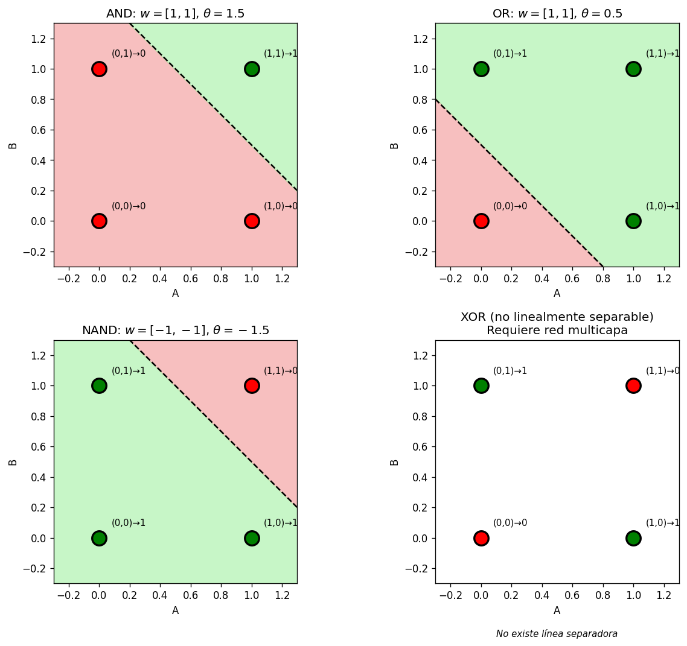

*Decision boundaries and truth-table outputs for NOT, AND, OR, and XOR. XOR requires a hidden layer, making it the first example of a multi-layer network.*

---

### 2. Hodgkin–Huxley model (1952)

The conductance-based model for the squid giant axon couples membrane potential $V$ to three gating variables $m$ (Na activation), $h$ (Na inactivation), and $n$ (K activation):

$$C_m \frac{dV}{dt} = I_{\rm ext} - g_{\rm Na}\,m^3 h\,(V - V_{\rm Na}) - g_{\rm K}\,n^4(V - V_{\rm K}) - g_L(V - V_L)$$

$$\frac{dx}{dt} = \alpha_x(V)(1-x) - \beta_x(V)\,x, \quad x \in \{m, h, n\}$$

The voltage-dependent rate functions $\alpha_x, \beta_x$ were fitted to voltage-clamp data from the squid axon. The model predicts threshold excitability, spike shape, refractory period, and repetitive firing at a critical Hopf bifurcation.

#### Action potentials and gating functions

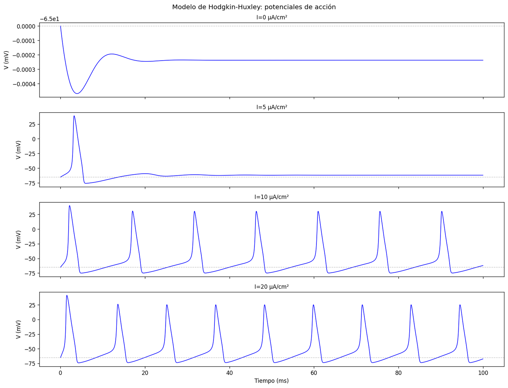

*Membrane potential $V(t)$ for sub-threshold, single-spike, and repetitive-firing current levels. Inset: bifurcation diagram (firing frequency vs $I_{\rm ext}$).*

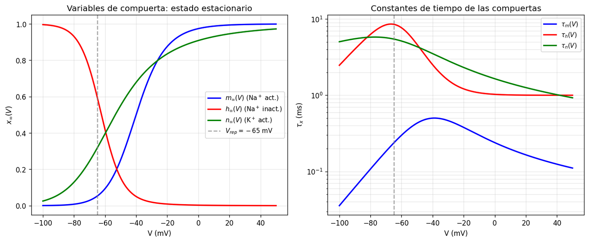

*Left: steady-state curves $m_\infty(V)$, $h_\infty(V)$, $n_\infty(V)$. Right: voltage-dependent time constants $\tau_m$, $\tau_h$, $\tau_n$.*

---

### 3. Hodgkin–Huxley reduced 2D model

Using the quasi-static approximation $m \approx m_\infty(V)$ and the empirical relation $h \approx 0.8 - n$, the 4D system reduces to two variables $(V, U)$ amenable to phase-plane analysis:

$$C_m \dot{V} = I - g_{\rm Na} m_\infty^3(V)(0.8-U)(V-V_{\rm Na}) - g_K U^4(V-V_K) - g_L(V-V_L)$$
$$\dot{U} = \frac{n_\infty(V) - U}{\tau_n(V)}$$

Nullclines, fixed points, and limit cycles are computed directly in the $(V, U)$ phase plane.

#### Phase portrait

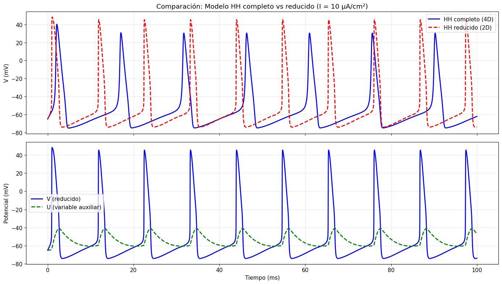

*$V$-nullcline (cubic), $U$-nullcline (monotone), and representative trajectories. The intersection determines the resting potential; suprathreshold stimuli send the trajectory around the limit cycle.*

---

### 4. FitzHugh–Nagumo model

A two-variable caricature capturing the essential topology of excitable membranes:

$$\dot{v} = v - \frac{v^3}{3} - w + I, \qquad \dot{w} = \varepsilon(v + a - bw), \quad \varepsilon \ll 1$$

Three dynamical regimes appear as $I$ varies:
- **Resting** (stable node/focus)
- **Excitable** (threshold-activated transient)
- **Oscillatory** (stable limit cycle via Andronov–Hopf bifurcation)

#### FitzHugh-Nagumo dynamics and bifurcation

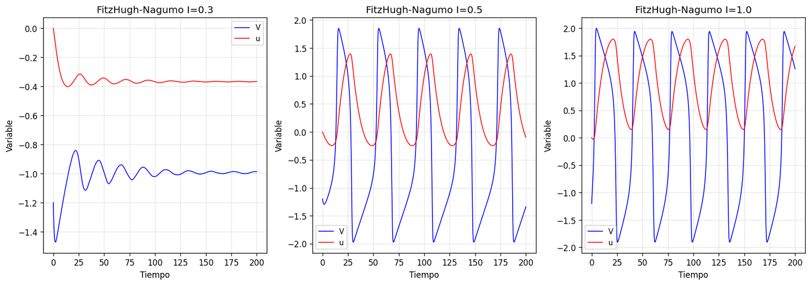

*Time series for the three regimes (left) and bifurcation diagram showing the stable fixed-point branch and the limit-cycle amplitude branch separated by a subcritical Hopf point (right).*

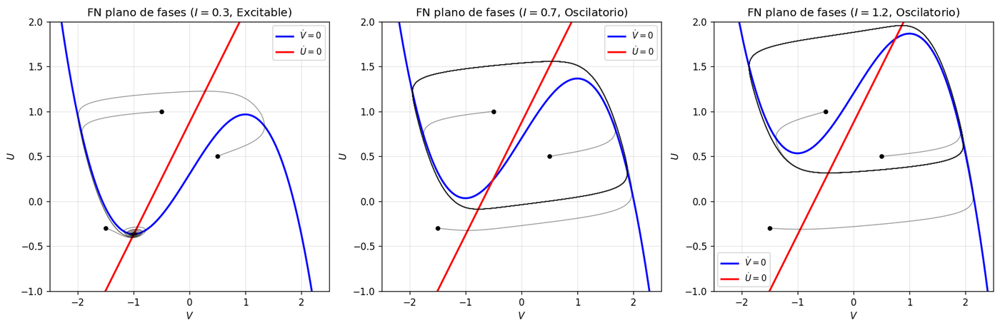

*Phase-plane portrait: cubic $v$-nullcline, linear $w$-nullcline, and trajectories for each regime.*

---

### 5. Electrical synapses — diffusive coupling

A gap junction between neurons $i$ and $j$ adds a linear coupling term:

$$C_m \dot{V}_i = \cdots + g_c \sum_{j \in \mathcal{N}(i)}(V_j - V_i)$$

On a 2D regular grid this is the discrete Laplacian; voltage spreads diffusively with coefficient $D = g_c \Delta x^2 / C_m$ and the spatial variance grows as:

$$\sigma^2(t) = \sigma_0^2 + 4Dt$$

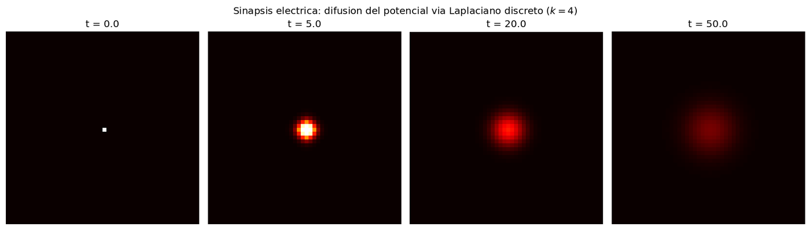

*Voltage profile at successive times on a 2D grid of gap-junction-coupled neurons. Gaussian broadening confirms diffusive transport; measured $D$ matches the theoretical prediction.*

---

### 6. Tsodyks–Markram dynamic synapse

Synaptic resources are partitioned into available ($x$), active ($y$), and inactive ($z$) fractions ($x + y + z = 1$):

$$\dot{x} = z/\tau_{\rm rec}, \quad \dot{y} = -y/\tau_{\rm in} + u\,x\,\delta(t-t_{\rm sp}), \quad \dot{z} = y/\tau_{\rm in} - z/\tau_{\rm rec}$$

The use variable $u$ models residual calcium:

$$\dot{u} = \frac{U_{\rm SE} - u}{\tau_{\rm facil}} + U_{\rm SE}(1-u)\,\delta(t-t_{\rm sp})$$

High $U_{\rm SE}$ → **synaptic depression** (EPSP amplitude decreases during burst). Low $U_{\rm SE}$ → **facilitation** (residual Ca²⁺ increases release probability).

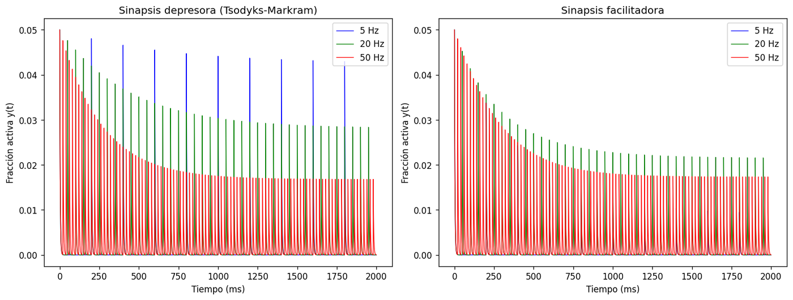

*EPSP amplitude trains for a depressing synapse (top) and a facilitating synapse (bottom) under identical spike-frequency protocols.*

---

### 7. Hopfield network at finite temperature

A fully connected network of $N$ Ising spins stores $P$ patterns $\{\boldsymbol{\xi}^\mu\}$ via Hebbian weights:

$$J_{ij} = \frac{1}{N}\sum_{\mu=1}^P \xi_i^\mu \xi_j^\mu, \quad J_{ii} = 0$$

Stochastic updates at temperature $T$:

$$P(s_i = +1) = \frac{1}{1 + e^{-2h_i/T}}, \quad h_i = \sum_j J_{ij} s_j$$

The mean-field overlap $m = \langle \xi_i^\mu s_i \rangle$ satisfies $m = \tanh(m/T)$, predicting a continuous phase transition at $T_c = 1$: perfect recall for $T < T_c$, disordered retrieval for $T > T_c$.

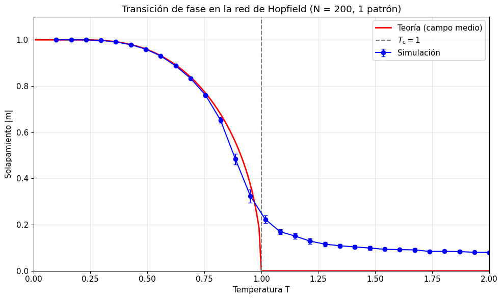

*Left: measured $m(T)$ (dots) vs mean-field prediction (line) — phase transition at $T_c = 1$. Right: pattern retrieval dynamics showing convergence from a noisy initial state to the stored attractor.*

---

## Part II — Social Dynamics on Networks

### 8. Voter model

Each node holds opinion $\sigma_i = \pm 1$. At each step a node copies a random neighbour. The magnetisation $m = N^{-1}\sum_i \sigma_i$ is **conserved in expectation** on any network; fluctuations drive eventual consensus in time $T_c \sim N$.

The topology controls the approach to consensus:
- **Watts–Strogatz** (small-world): higher rewiring probability $p_{\rm rw}$ shortens $T_c$ — shortcuts spread consensus faster
- **Barabási–Albert** (scale-free): hubs enforce $\langle m(t) \rangle = m(0)$; variance decays as $\sim 1/N$

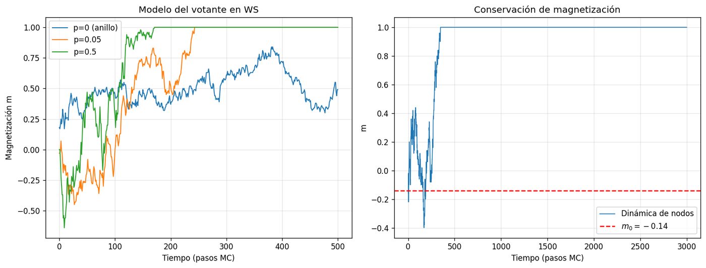

*Magnetisation $m(t)$ on WS networks for several rewiring probabilities. Solid: ensemble average; shaded: individual realisations. More shortcuts → faster consensus.*

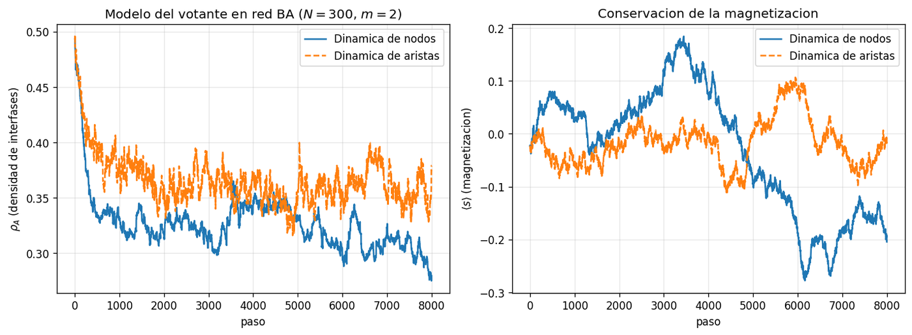

*Voter model on a BA scale-free network with $m(0) = 0.2$. Individual realisations (thin) fluctuate but the ensemble mean (thick) is stationary at $m(0)$, confirming magnetisation conservation.*

---

### 9. Abrams–Strogatz language competition

Two languages $A$ (fraction $x$) and $B$ (fraction $1-x$) compete via:

$$\frac{dx}{dt} = (1-x)\,\sigma x^a - x\,(1-\sigma)(1-x)^a$$

- $\sigma \in (0,1)$: prestige of language $A$
- $a > 0$: volatility (social sensitivity)

**Phase structure**:
| Parameter regime | Stable fixed points | Outcome |
|---|---|---|
| $a > 1$ | $x = 0$ and $x = 1$ | One language wins (determined by $\sigma$) |
| $a < 1$ | $x^* \in (0,1)$ | Stable coexistence |
| $a = 1$ | All $x$ (neutral) | Marginal |

The critical line $a = 1$ separates coexistence from winner-takes-all dynamics.

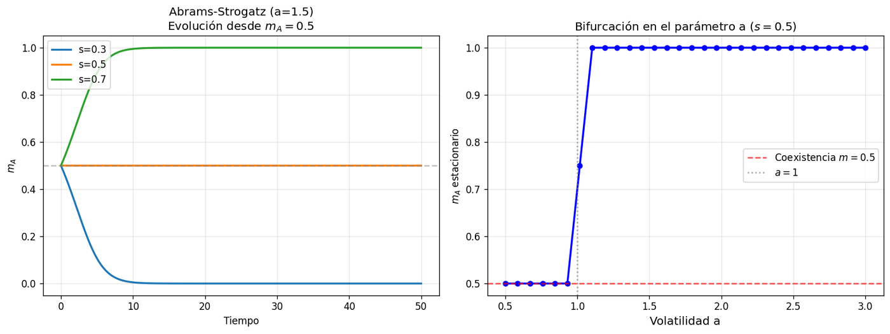

*Top: phase diagram in the $(\sigma, a)$ plane. Bottom: temporal evolution of $x(t)$ for four representative parameter pairs — extinction, coexistence, and asymmetric outcomes.*

---

## Part III — Ecological Networks

### 10. Niche model of food webs

The **niche model** (Williams & Martinez 2000) generates realistic food webs by assigning each species a niche value $n_i \sim U(0,1)$ and a diet range $[c_i - r_i/2,\, c_i + r_i/2]$ drawn from a Beta distribution tuned to a target connectance $C$:

$$\langle k \rangle = 2CN, \quad r_i \sim \beta\text{-distribution}$$

**Trophic coherence** $q$ measures how well species sort into integer trophic levels. For each directed edge $(i \to j)$ the trophic distance is $x_{ij} = s_j - s_i - 1$, where $s_i$ is the trophic level. A perfectly coherent web has all $x_{ij} = 0$; the coherence parameter $T$ (temperature) quantifies the spread:

$$q = \frac{1}{\sqrt{1 + T^2/\langle x \rangle^2}}$$

**May stability criterion**: a random $N \times N$ interaction matrix is stable if $\sigma\sqrt{NC} < 1$, where $\sigma$ is the interaction-strength variance and $C$ is the connectance. Trophically coherent webs are systematically more stable than incoherent ones at the same $N$ and $C$.

#### Food web trophic properties

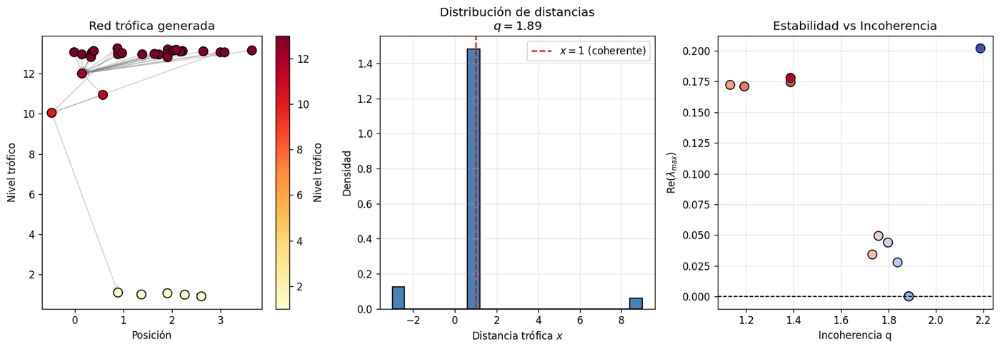

*Left: spectral abscissa $R$ (largest real part of eigenvalues of the interaction matrix) vs trophic coherence $q$ — more coherent webs are more stable ($R < 0$). Right: trophic distance distribution $p(x)$ for low-$T$ (coherent) and high-$T$ (incoherent) food webs.*

#### Size effects and May's criterion

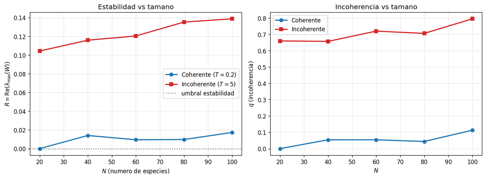

*Stability $R$ and coherence $q$ as a function of network size $N$ (constant connectance). May's criterion $\sigma\sqrt{NC} = 1$ is shown as the dashed line. Coherent webs (low $T$) remain stable well beyond the May threshold.*

---

## Dependencies

```bash
pip install numpy scipy numba matplotlib networkx
```

Run any notebook:

```bash
jupyter notebook notebooks/Neural_Networks.ipynb
```

---

## Author

**A. S. Amari Rabah**

Developed as part of the coursework for *Physics of Complex Networks and Interdisciplinary Applications* — Master's Degree in Physics and Mathematics - Fisymat, University of Granada, Spain.
